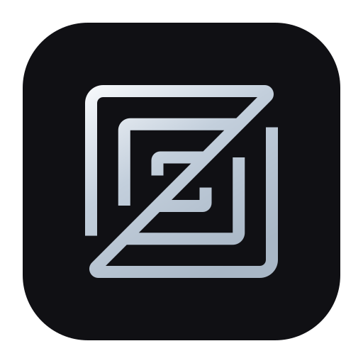
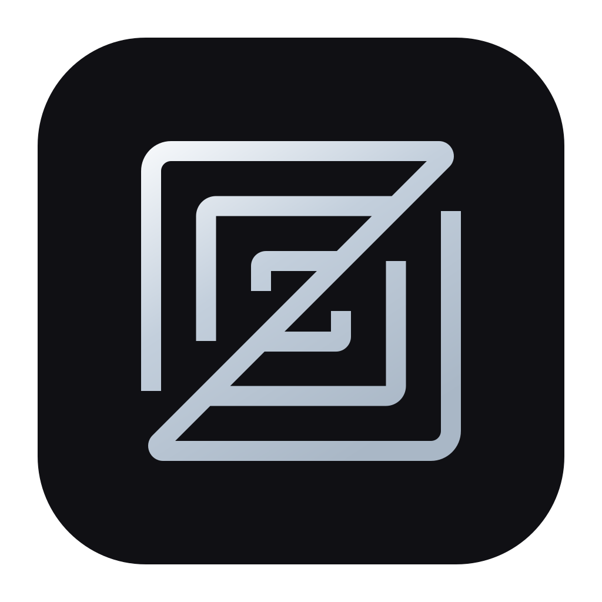
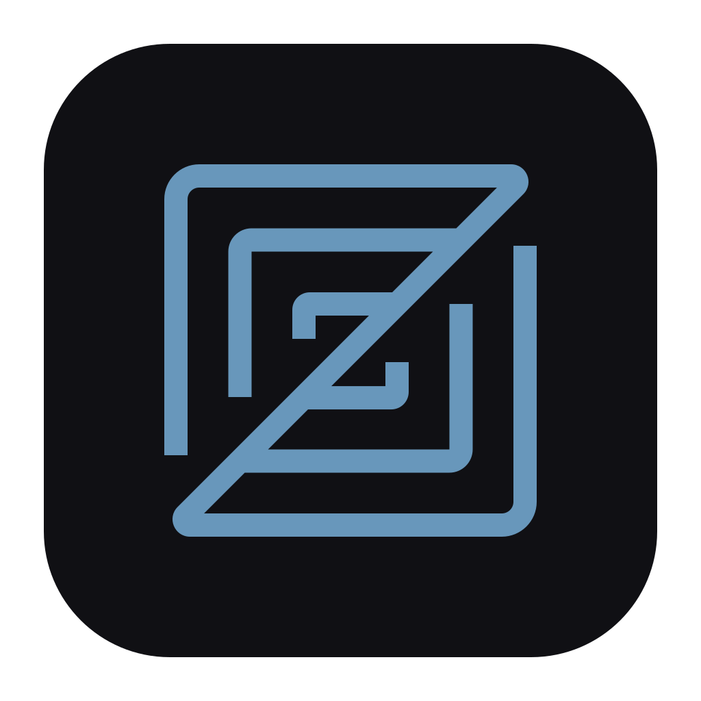
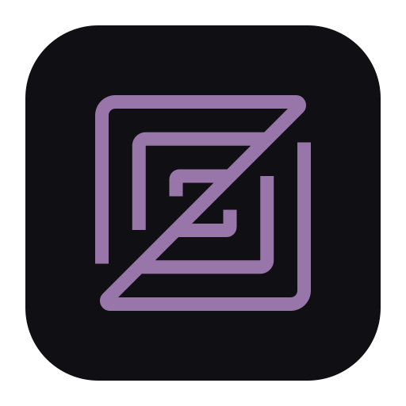
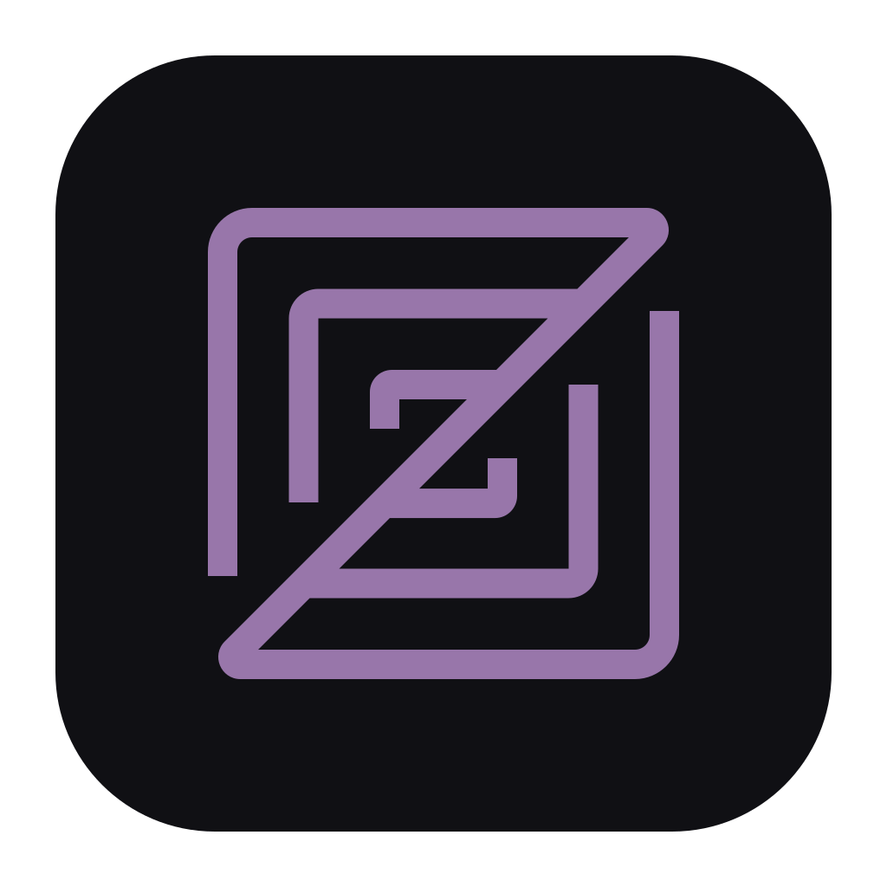

# Icons

Visual inventory of icons in this checkout. **Shipped Zed app icons** under
`crates/zed/resources/` are rendered from the vector masters in
`assets/branding/jetbrains-darcula-concepts/` — a flat `#101014` plate with a
silver mark (regenerate with
`uv run --with pillow python script/apply_branding_icons.py --zed-only`).
Validate all Windows icon sizes with
`uv run --with pillow python script/apply_branding_icons.py --check`.
Generation also requires ImageMagick 7's `magick` executable: Windows ICO entries
below 256 px are BMP32, while the 256 px entry is embedded PNG.

## Synth app icons (applied)

Matching Synth icons for Zed and Warp. Wired into Zed
(`crates/zed/resources/`) and Warp (`app/channels/oss`, `warp-oss`, `local`).
Vector masters and the design notes: `assets/branding/jetbrains-darcula-concepts/`.
The two PNGs below are generated previews, not sources.

<table>
<tr>
<td align="center"> <b>Synth Zed</b></td>
<td align="center"> <b>Synth Warp</b></td>
</tr>
</table>

## App icons

OS / installer / About-window art. All generated — edit the SVG masters, not these files. Channels
share one plate and one mark; only the glyph tint differs (preview `#6897BB`, nightly `#9876AA`,
dev `#CC7832`).

| Channel | 512 (`app-icon*.png`) | 1024 (`@2x`) | Windows ICO |
| --- | --- | --- | --- |
| Stable `app-icon.png` |  |  | `windows/app-icon.ico` |
| Preview `app-icon-preview.png` |  |  | `windows/app-icon-preview.ico` |
| Nightly `app-icon-nightly.png` |  |  | `windows/app-icon-nightly.ico` |
| Dev `app-icon-dev.png` |  |  | `windows/app-icon-dev.ico` |

Paths are under `crates/zed/resources/`. Wired from `crates/zed/Cargo.toml` (`package.metadata.bundle-*`), `crates/windows_resources`, `crates/zed/src/zed.rs` (About), and `script/bundle-*`.

## Product marks

| File | Preview |
| --- | --- |
| `images/business_stamp.svg` |  |
| `images/grid.svg` |  |
| `images/pro_trial_stamp.svg` |  |
| `images/pro_user_stamp.svg` |  |
| `images/student_stamp.svg` |  |
| `images/vip_stamp.svg` |  |
| `images/zed_logo.svg` |  |
| `images/zed_x_copilot.svg` |  |

`images/zed_logo.svg` is the Zed logomark from https://zed.dev/brand (96×96). It is both the
in-product mark and the glyph the OS app icons are built from — the branding masters place this
exact path on the Synth plate rather than redrawing it.

## UI icons

SVGs in `assets/icons/` (16×16, black stroke). They may disappear on a dark markdown theme; previews sit on white.

Guidelines: `crates/icons/README.md`. Enum: `crates/icons/src/icons.rs`.

### UI icons (root)

| Preview | Name |
| --- | --- |
|  | `acp_registry.svg` |
|  | `ai_anthropic.svg` |
|  | `ai_anthropic_compat.svg` |
|  | `ai_bedrock.svg` |
|  | `ai_claude.svg` |
|  | `ai_deep_seek.svg` |
|  | `ai_edit.svg` |
|  | `ai_gemini.svg` |
|  | `ai_google.svg` |
|  | `ai_llama_cpp.svg` |
|  | `ai_lm_studio.svg` |
|  | `ai_mistral.svg` |
|  | `ai_ollama.svg` |
|  | `ai_open_ai.svg` |
|  | `ai_open_ai_compat.svg` |
|  | `ai_open_ai_gpt_sub.svg` |
|  | `ai_open_code.svg` |
|  | `ai_open_router.svg` |
|  | `ai_vercel.svg` |
|  | `ai_x_ai.svg` |
|  | `ai_zed.svg` |
|  | `archive.svg` |
|  | `arrow_circle.svg` |
|  | `arrow_down.svg` |
|  | `arrow_down10.svg` |
|  | `arrow_down_right.svg` |
|  | `arrow_left.svg` |
|  | `arrow_right.svg` |
|  | `arrow_right_left.svg` |
|  | `arrow_up.svg` |
|  | `arrow_up_right.svg` |
|  | `at_sign.svg` |
|  | `attach.svg` |
|  | `audio_off.svg` |
|  | `audio_on.svg` |
|  | `backspace.svg` |
|  | `bell.svg` |
|  | `bell_dot.svg` |
|  | `bell_off.svg` |
|  | `bell_ring.svg` |
|  | `binary.svg` |
|  | `bitbucket.svg` |
|  | `blocks.svg` |
|  | `bolt_filled.svg` |
|  | `bolt_outlined.svg` |
|  | `book.svg` |
|  | `book_copy.svg` |
|  | `bookmark.svg` |
|  | `box.svg` |
|  | `box_open.svg` |
|  | `case_sensitive.svg` |
|  | `chat.svg` |
|  | `check.svg` |
|  | `check_double.svg` |
|  | `chevron_down.svg` |
|  | `chevron_down_up.svg` |
|  | `chevron_left.svg` |
|  | `chevron_right.svg` |
|  | `chevron_up.svg` |
|  | `chevron_up_down.svg` |
|  | `circle.svg` |
|  | `circle_help.svg` |
|  | `clock.svg` |
|  | `close.svg` |
|  | `cloud_download.svg` |
|  | `code.svg` |
|  | `codeberg.svg` |
|  | `command.svg` |
|  | `compact.svg` |
|  | `control.svg` |
|  | `copilot.svg` |
|  | `copilot_disabled.svg` |
|  | `copilot_error.svg` |
|  | `copilot_init.svg` |
|  | `copy.svg` |
|  | `countdown_timer.svg` |
|  | `crosshair.svg` |
|  | `cursor_i_beam.svg` |
|  | `dash.svg` |
|  | `database_zap.svg` |
|  | `debug.svg` |
|  | `debug_breakpoint.svg` |
|  | `debug_continue.svg` |
|  | `debug_detach.svg` |
|  | `debug_disabled_breakpoint.svg` |
|  | `debug_disabled_log_breakpoint.svg` |
|  | `debug_ignore_breakpoints.svg` |
|  | `debug_log_breakpoint.svg` |
|  | `debug_pause.svg` |
|  | `debug_step_into.svg` |
|  | `debug_step_out.svg` |
|  | `debug_step_over.svg` |
|  | `diff.svg` |
|  | `diff_split.svg` |
|  | `diff_split_auto.svg` |
|  | `diff_unified.svg` |
|  | `disconnected.svg` |
|  | `download.svg` |
|  | `editor_atom.svg` |
|  | `editor_cursor.svg` |
|  | `editor_emacs.svg` |
|  | `editor_jet_brains.svg` |
|  | `editor_sublime.svg` |
|  | `editor_vs_code.svg` |
|  | `ellipsis.svg` |
|  | `envelope.svg` |
|  | `eraser.svg` |
|  | `escape.svg` |
|  | `exit.svg` |
|  | `expand_down.svg` |
|  | `expand_up.svg` |
|  | `expand_vertical.svg` |
|  | `eye.svg` |
|  | `eye_off.svg` |
|  | `fast_forward.svg` |
|  | `fast_forward_off.svg` |
|  | `file.svg` |
|  | `file_code.svg` |
|  | `file_diff.svg` |
|  | `file_doc.svg` |
|  | `file_generic.svg` |
|  | `file_git.svg` |
|  | `file_ignored.svg` |
|  | `file_lock.svg` |
|  | `file_markdown.svg` |
|  | `file_multiple.svg` |
|  | `file_rust.svg` |
|  | `file_text_filled.svg` |
|  | `file_text_outlined.svg` |
|  | `file_toml.svg` |
|  | `file_tree.svg` |
|  | `filter.svg` |
|  | `flame.svg` |
|  | `fold_vertical.svg` |
|  | `folder.svg` |
|  | `folder_add.svg` |
|  | `folder_include.svg` |
|  | `folder_open.svg` |
|  | `folder_search.svg` |
|  | `folder_share.svg` |
|  | `folder_shared.svg` |
|  | `font.svg` |
|  | `font_size.svg` |
|  | `font_weight.svg` |
|  | `forgejo.svg` |
|  | `forward_arrow.svg` |
|  | `forward_arrow_up.svg` |
|  | `generic_close.svg` |
|  | `generic_maximize.svg` |
|  | `generic_minimize.svg` |
|  | `generic_restore.svg` |
|  | `gerrit.svg` |
|  | `git_branch.svg` |
|  | `git_branch_plus.svg` |
|  | `git_commit.svg` |
|  | `git_graph.svg` |
|  | `git_merge_conflict.svg` |
|  | `git_worktree.svg` |
|  | `gitea.svg` |
|  | `github.svg` |
|  | `gitlab.svg` |
|  | `hash.svg` |
|  | `history_rerun.svg` |
|  | `image.svg` |
|  | `inception.svg` |
|  | `indicator.svg` |
|  | `info.svg` |
|  | `json.svg` |
|  | `keyboard.svg` |
|  | `line_height.svg` |
|  | `link.svg` |
|  | `linux.svg` |
|  | `list_collapse.svg` |
|  | `list_todo.svg` |
|  | `list_tree.svg` |
|  | `list_x.svg` |
|  | `load_circle.svg` |
|  | `location_edit.svg` |
|  | `lock.svg` |
|  | `lock_off.svg` |
|  | `magnifying_glass.svg` |
|  | `maximize.svg` |
|  | `maximize_alt.svg` |
|  | `menu.svg` |
|  | `mic.svg` |
|  | `mic_mute.svg` |
|  | `minimize.svg` |
|  | `notepad.svg` |
|  | `on_call.svg` |
|  | `option.svg` |
|  | `page_down.svg` |
|  | `page_up.svg` |
|  | `paperclip.svg` |
|  | `pencil.svg` |
|  | `pencil_unavailable.svg` |
|  | `person.svg` |
|  | `pin.svg` |
|  | `play_filled.svg` |
|  | `play_outlined.svg` |
|  | `plus.svg` |
|  | `power.svg` |
|  | `public.svg` |
|  | `pull_request.svg` |
|  | `queue_message.svg` |
|  | `quote.svg` |
|  | `reader.svg` |
|  | `refresh_title.svg` |
|  | `regex.svg` |
|  | `repl_neutral.svg` |
|  | `replace.svg` |
|  | `replace_all.svg` |
|  | `replace_next.svg` |
|  | `reply_arrow_right.svg` |
|  | `rerun.svg` |
|  | `return.svg` |
|  | `rotate_ccw.svg` |
|  | `rotate_cw.svg` |
|  | `scissors.svg` |
|  | `screen.svg` |
|  | `select_all.svg` |
|  | `send.svg` |
|  | `server.svg` |
|  | `settings.svg` |
|  | `share.svg` |
|  | `shift.svg` |
|  | `signal_high.svg` |
|  | `signal_low.svg` |
|  | `signal_medium.svg` |
|  | `slash.svg` |
|  | `sourcehut.svg` |
|  | `space.svg` |
|  | `sparkle.svg` |
|  | `split.svg` |
|  | `split_alt.svg` |
|  | `square_dot.svg` |
|  | `square_minus.svg` |
|  | `square_plus.svg` |
|  | `star.svg` |
|  | `star_filled.svg` |
|  | `stop.svg` |
|  | `tab.svg` |
|  | `table.svg` |
|  | `terminal.svg` |
|  | `terminal_alt.svg` |
|  | `text_snippet.svg` |
|  | `text_unwrap.svg` |
|  | `text_wrap.svg` |
|  | `thinking_mode.svg` |
|  | `thinking_mode_off.svg` |
|  | `this_window.svg` |
|  | `thread.svg` |
|  | `thread_from_summary.svg` |
|  | `threads_sidebar_left_closed.svg` |
|  | `threads_sidebar_left_open.svg` |
|  | `threads_sidebar_right_closed.svg` |
|  | `threads_sidebar_right_open.svg` |
|  | `thumbs_down.svg` |
|  | `thumbs_up.svg` |
|  | `todo_complete.svg` |
|  | `todo_pending.svg` |
|  | `todo_progress.svg` |
|  | `tool_copy.svg` |
|  | `tool_delete_file.svg` |
|  | `tool_diagnostics.svg` |
|  | `tool_hammer.svg` |
|  | `tool_notification.svg` |
|  | `tool_pencil.svg` |
|  | `tool_search.svg` |
|  | `tool_terminal.svg` |
|  | `tool_think.svg` |
|  | `tool_web.svg` |
|  | `trash.svg` |
|  | `triangle.svg` |
|  | `triangle_right.svg` |
|  | `undo.svg` |
|  | `unpin.svg` |
|  | `user_arrow_up.svg` |
|  | `user_check.svg` |
|  | `user_group.svg` |
|  | `user_round_pen.svg` |
|  | `warning.svg` |
|  | `whole_word.svg` |
|  | `x_circle.svg` |
|  | `x_circle_filled.svg` |
|  | `zed_agent.svg` |
|  | `zed_agent_two.svg` |
|  | `zed_assistant.svg` |
|  | `zed_predict.svg` |
|  | `zed_predict_disabled.svg` |
|  | `zed_predict_down.svg` |
|  | `zed_predict_error.svg` |
|  | `zed_predict_up.svg` |
|  | `zed_src_custom.svg` |
|  | `zed_src_extension.svg` |

### UI icons / `file_icons`

| Preview | Name |
| --- | --- |
|  | `file_icons/ai.svg` |
|  | `file_icons/archive.svg` |
|  | `file_icons/astro.svg` |
|  | `file_icons/audio.svg` |
|  | `file_icons/ballerina.svg` |
|  | `file_icons/book.svg` |
|  | `file_icons/bun.svg` |
|  | `file_icons/c.svg` |
|  | `file_icons/cairo.svg` |
|  | `file_icons/camera.svg` |
|  | `file_icons/chevron_down.svg` |
|  | `file_icons/chevron_left.svg` |
|  | `file_icons/chevron_right.svg` |
|  | `file_icons/chevron_up.svg` |
|  | `file_icons/code.svg` |
|  | `file_icons/coffeescript.svg` |
|  | `file_icons/conversations.svg` |
|  | `file_icons/cpp.svg` |
|  | `file_icons/css.svg` |
|  | `file_icons/dart.svg` |
|  | `file_icons/database.svg` |
|  | `file_icons/diff.svg` |
|  | `file_icons/docker.svg` |
|  | `file_icons/editorconfig.svg` |
|  | `file_icons/elixir.svg` |
|  | `file_icons/elm.svg` |
|  | `file_icons/erlang.svg` |
|  | `file_icons/eslint.svg` |
|  | `file_icons/file.svg` |
|  | `file_icons/folder.svg` |
|  | `file_icons/folder_open.svg` |
|  | `file_icons/font.svg` |
|  | `file_icons/fsharp.svg` |
|  | `file_icons/git.svg` |
|  | `file_icons/gitlab.svg` |
|  | `file_icons/gleam.svg` |
|  | `file_icons/go.svg` |
|  | `file_icons/graphql.svg` |
|  | `file_icons/hash.svg` |
|  | `file_icons/haskell.svg` |
|  | `file_icons/hcl.svg` |
|  | `file_icons/helm.svg` |
|  | `file_icons/heroku.svg` |
|  | `file_icons/html.svg` |
|  | `file_icons/image.svg` |
|  | `file_icons/info.svg` |
|  | `file_icons/java.svg` |
|  | `file_icons/javascript.svg` |
|  | `file_icons/julia.svg` |
|  | `file_icons/jupyter.svg` |
|  | `file_icons/kdl.svg` |
|  | `file_icons/kotlin.svg` |
|  | `file_icons/lock.svg` |
|  | `file_icons/lua.svg` |
|  | `file_icons/luau.svg` |
|  | `file_icons/magnifying_glass.svg` |
|  | `file_icons/metal.svg` |
|  | `file_icons/nim.svg` |
|  | `file_icons/nix.svg` |
|  | `file_icons/notebook.svg` |
|  | `file_icons/ocaml.svg` |
|  | `file_icons/odin.svg` |
|  | `file_icons/package.svg` |
|  | `file_icons/phoenix.svg` |
|  | `file_icons/php.svg` |
|  | `file_icons/plus.svg` |
|  | `file_icons/prettier.svg` |
|  | `file_icons/prisma.svg` |
|  | `file_icons/project.svg` |
|  | `file_icons/puppet.svg` |
|  | `file_icons/python.svg` |
|  | `file_icons/r.svg` |
|  | `file_icons/react.svg` |
|  | `file_icons/replace.svg` |
|  | `file_icons/replace_all.svg` |
|  | `file_icons/replace_next.svg` |
|  | `file_icons/roc.svg` |
|  | `file_icons/ruby.svg` |
|  | `file_icons/rust.svg` |
|  | `file_icons/sass.svg` |
|  | `file_icons/scala.svg` |
|  | `file_icons/settings.svg` |
|  | `file_icons/surrealql.svg` |
|  | `file_icons/swift.svg` |
|  | `file_icons/tcl.svg` |
|  | `file_icons/terminal.svg` |
|  | `file_icons/terraform.svg` |
|  | `file_icons/toml.svg` |
|  | `file_icons/typescript.svg` |
|  | `file_icons/v.svg` |
|  | `file_icons/video.svg` |
|  | `file_icons/vue.svg` |
|  | `file_icons/vyper.svg` |
|  | `file_icons/wgsl.svg` |
|  | `file_icons/yaml.svg` |
|  | `file_icons/zig.svg` |

### UI icons / `knockouts`

| Preview | Name |
| --- | --- |
|  | `knockouts/dot_bg.svg` |
|  | `knockouts/dot_fg.svg` |
|  | `knockouts/triangle_bg.svg` |
|  | `knockouts/triangle_fg.svg` |
|  | `knockouts/x_bg.svg` |
|  | `knockouts/x_fg.svg` |

_Total UI SVGs: 396_

