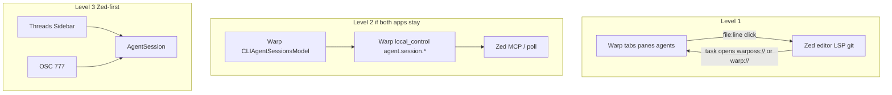

# Overview

Parent: [Zed × Warp Hybrid](README.md)

**Do not embed one app in the other.** Copy **behavior and protocols**, not widgets. See [Licenses](licenses.md).

**Aim for Zed as the base** if features ever merge. The editor, LSP, debugger, Git, ACP, and parallel-agent sidebar are the hard parts. Warp’s remaining edge is *session/agent UX around CLI harnesses* — a protocol problem more than a UI-framework problem.

Until then:

- **Zed** owns buffers, LSP, debugger, git UI, worktree authority
- **Warp** owns PTYs, blocks, CLI-agent status, tab layouts — when Warp is the session host
- Map Warp tab ↔ Zed project by **worktree path**, not window title

## The three levels {#three-levels}

1. **[Use both apps](level-1.md)** — Warp opens file links in Zed (macOS/Linux today; [Windows](constraints/windows.md) needs a patch). A Zed task can open `warposs://` (Synth Warp) or `warp://` (upstream). Most of a useful hybrid with little new code.
2. **[Bridge](level-2.md)** — only if both apps remain in the daily workflow. Warp **exports** live [AgentSession](agent-session.md) over `local_control`. Zed **consumes** via poll/MCP/tasks. Skip this if Synth Zed hosts every agent ([Phase A](phase-a-status.md) instead). Do not add a competing `~/.devsessions` source of truth.
3. **[Port Warp behavior into Zed](level-3.md)** — status protocol, launcher, optional blocks, optional rich input. Requires Zed core/fork; a [Zed extension cannot](constraints/zed-extensions.md) add that chrome.

Which merge direction is easier? **Add Warp session UX to Zed**, not Zed’s editor to Warp. Warp’s native editor closed much of the old “Warp = terminal, Zed = editor” gap. Transplanting Zed `editor` / `project` / LSP / GPUI into Warp would pull in most of the hard machinery. See [native Warp editor](surfaces/native-editor.md).

## Why this is feasible now {#why-now}

Zed’s Terminal Threads created the missing *surface*: CLI agents appear in the Threads Sidebar next to ACP and native threads.

Warp’s open client made the missing *protocol* inspectable: OSC 777 `warp://cli-agent` JSON, vertical-tab metadata, Tab Configs, BlockList. Drive, Oz, and auth backends stay proprietary and must not be assumed ([Synth forks](constraints/synth-fork.md)). Synth Zed likewise unwires hosted Zed AI / Zeta / zed.dev collab and Pro upsells — hybrid designs must not reintroduce those.

The remaining work is either (dual-app) exporting that protocol over [local control](surfaces/local-control.md), or (Zed-only) connecting it to sidebar badges ACP threads already have — [Phase A](phase-a-status.md).

## See also

- [Current state](current-state.md)
- [AgentSession](agent-session.md)
- [Feasibility](feasibility.md)
- [What not to build](what-not-to-build.md)
